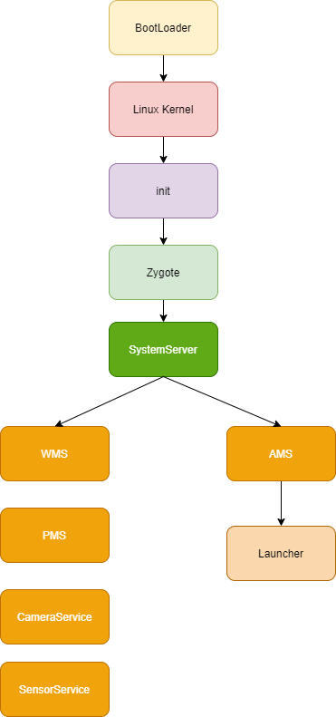

##  1 Android 系统启动流程



### 1.1 启动电源以及系统启动

当电源按下时引导芯片代码开始从预定义的地方（固化在ROM）开始执行。加载引导程序 Bootloader 到 RAM，然后执行。

### 1.2 引导程序 BootLoader

引导程序 BootLoader 是在 Android 操作系统开始运行前的一个小程序，主要作用是把系统 OS 拉起来并运行。

### 1.3 Linux 内核启动

内核启动时，设置缓存、被保护存储器、计划列表、加载驱动。当内核完成系统设置，它首先在系统文件中寻找init.rc 文件，并启动 init 进程。

* init.rc 是由 Android 初始化语言编写的脚本，包含 5 种类型：Action、Command、Service、Option、Import。

### 1.4 init 进程启动

初始化和启动属性服务，并且启动 Zygote 进程。

* 创建和挂载启动所需的文件目录
* 初始化和启动属性服务
* 解析 init.rc 配置文件并启动 Zygote 进程

### 1.5 Zygote 进程启动

创建 Java 虚拟机并为 Java 虚拟机注册 JNI，创建服务端 Socket，启动 SystemServer 进程。

* Zygote：孵化器，通过 fork 的形式创建应用进程和 SystemServer 进程。
* Zygote 启动脚本（init.zygote32.rc、init.zygote32_64.rc、init.zygote64.rc、init.zygote64_32.rc）

### 1.6 SystemServer 进程启动

启动 Binder 线程池和 SystemServiceManager，并且启动各种系统服务。

```java
ZygoteInit.nativeZygoteInit() //启动 Binder 线程池 是 Native 方法
```

### 1.7 Launcher 启动

被 SystemServer 进程启动的 ActivityManagerService 会启动 Launcher，Launcher 启动后会将已安装应用的快捷图标显示到界面上。