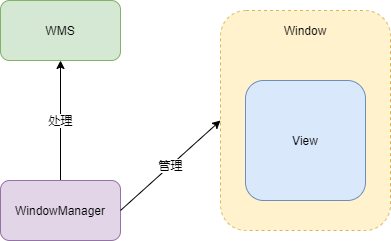

## 1 Window、WindowsManager、WMS

* Window 是一个抽象类，实现类为 PhoneWindow，对 View 进行管理。
* WindowManager 是一个接口类，继承于接口 ViewManager，管理 Window（更新、添加、删除操作等），实现类为 WindowManagerImpl

* WindowManager 具体的工作交由 WMS 处理，WindowManager 和 WMS 通过 Binder 跨进程通信。

具体如下图所示：



## 2 WindowManager 的关联类

WindowManager 是一个接口类，继承于接口 **ViewManager**，管理 Window（更新、添加、删除操作等），实现类为 WindowManagerImpl。

```java
//ViewManager.java
public interface ViewManager
{
       
    public void addView(View view, ViewGroup.LayoutParams params);//添加
    public void updateViewLayout(View view, ViewGroup.LayoutParams params);//更新
    public void removeView(View view);//移除
}

```

###  2.1 Window 创建

Window 是一个抽象类，实现类为 PhoneWindow，在 Activity 中 attach 中创建。

```java
//Activity.java
final void attach(...) {
   // 创建 PhoneWIndow
   mWindow = new PhoneWindow(this, window, activityConfigCallback);
   ...
   // setWindowManager 这个方法在 Window 中     
   mWindow.setWindowManager(
                (WindowManager)context.getSystemService(Context.WINDOW_SERVICE),
                mToken, mComponent.flattenToString(),
                (info.flags & ActivityInfo.FLAG_HARDWARE_ACCELERATED) != 0);    
   ... 
} 

//Window.java
public void setWindowManager(WindowManager wm, IBinder appToken, String appName,
            boolean hardwareAccelerated) {
        ...
        //这里最终创建 WindowManagerImpl    
        if (wm == null) {
            wm = (WindowManager)mContext.getSystemService(Context.WINDOW_SERVICE);
        }
        // 创建 WindowManagerImpl 将 Window 传进去，WindowManagerImpl 持有 Window 就可以进行操作
        mWindowManager = ((WindowManagerImpl)wm).createLocalWindowManager(this);  
}

//WindowManagerImpl.java
private WindowManagerImpl(Context context, Window parentWindow) {
     mContext = context;
     mParentWindow = parentWindow;
}

//WindowManagerImpl 并没有什么功能，最终交由 WindowManagerGlobal 实现，例如 addView
@Override
public void addView(@NonNull View view, @NonNull ViewGroup.LayoutParams params) {
    applyDefaultToken(params);
    //private final WindowManagerGlobal mGlobal = WindowManagerGlobal.getInstance();
    mGlobal.addView(view, params, mContext.getDisplay(), mParentWindow);
}
```

## 3 Window 属性

定义在 WindowManager 内部类 LayoutParams 中，主要相关的是三种属性：

* Type（类型）
* Flag（标志）
* SoftInputMode（软键盘相关模式）

### 3.1 Type（类型）

三种：

* Application Window（应用程序窗口）：Type 值 1-99
* Sub Window（子窗口）：不能独立存在，依赖于其他窗口，Type 值1000-1999
* Sysytem Window（系统窗口）：Toast、输入法窗口、系统错误窗口等，Type 值 2000-2999

### 3.2 Flag（标志）

用来控制 Window 显示，定义在 WindowManager 内部类 LayoutParams 中。

```java
Window win = getWindow();
win.addFlags(WindowManager.LayoutParams.FLAG_SHOW_WHEN_LOCKED);
//win.setFlags(WindowManager.LayoutParams.FLAG_SHOW_WHEN_LOCKED);

//弹出窗口后的内容变暗。
public static final int FLAG_DIM_BEHIND       = 0x00000002;
//弹出窗口后的内容变模糊。
public static final int FLAG_BLUR_BEHIND       = 0x00000004;
//弹出窗口不能获得按键输入事件，事件将会往其他窗口传递。
public static final int FLAG_NOT_FOCUSABLE     = 0x00000008;
//弹出窗口不接受触摸屏事件，事件将会往其他窗口传递。
public static final int FLAG_NOT_TOUCHABLE     = 0x00000010;
//当设备休眠时，点击触摸屏，弹出窗口将收到这个触摸事件。
public static final int FLAG_NOT_TOUCH_MODAL   = 0x00000020;
//触摸事件被系统所消耗，用户不会看到他们点击屏幕有什么反应。
public static final int FLAG_TOUCHABLE_WHEN_WAKING = 0x00000040;
//弹出窗口可见时，保持设备常亮不变。
public static final int FLAG_KEEP_SCREEN_ON    = 0x00000080;
//弹出窗口占满整个屏幕，忽略周围的装饰边框（例如状态栏）。
public static final int FLAG_LAYOUT_IN_SCREEN   =0x00000100;
//允许弹出窗口扩展到屏幕之外。
public static final int FLAG_LAYOUT_NO_LIMITS   =0x00000200;
//弹出窗口显示时，隐藏所有的屏幕装饰（例如状态条）。
public static final int FLAG_FULLSCREEN     = 0x00000400;
//此选项将覆盖FLAG_FULLSCREEN选项，并强制屏幕装饰（如状态条）弹出。
public static final int FLAG_FORCE_NOT_FULLSCREEN   =0x00000800;
//弹出窗口半透明的显示处理方法，又称“点透”。通常用于图形处理较差的设备。
public static final int FLAG_DITHER           = 0x00001000;
//弹出窗口不允许屏幕截图。
public static final int FLAG_SECURE           = 0x00002000;
//弹出窗口特殊模式，布局参数用于指示显示比例。
public static final int FLAG_SCALED           = 0x00004000;
//当屏幕有贴着脸时，防止面颊对屏幕造成误操作。
public static final int FLAG_IGNORE_CHEEK_PRESSES   = 0x00008000;
//确保窗口内容不会被装饰条（状态栏）盖住。
public static final int FLAG_LAYOUT_INSET_DECOR = 0x00010000;
//窗口不能与输入法交互，覆盖输入法窗口。（同时设置FLAG_NOT_FOCUSABLE，窗口将能够与输入法交互，输入法窗口覆盖）
public static final int FLAG_ALT_FOCUSABLE_IM = 0x00020000;
//当触屏事件发生在弹出窗口之外，可以通过设置此标志接收到一个MotionEvent.ACTION_OUTSIDE事件。
public static final int FLAG_WATCH_OUTSIDE_TOUCH = 0x00040000;
//当屏幕锁定时，弹出窗口可以被看到。这使得应用程序窗口优先于锁屏界面。可配合FLAG_KEEP_SCREEN_ON
public static final int FLAG_SHOW_WHEN_LOCKED = 0x00080000;
//系统墙纸显示为弹出窗口背景。窗口必须是半透明的。
public static final int FLAG_SHOW_WALLPAPER = 0x00100000;
//窗口一旦显示出来，系统将点亮屏幕。
public static final int FLAG_TURN_SCREEN_ON = 0x00200000;
//弹出窗口时解除锁屏。锁屏界面非加密才能解锁。如果是加密的，需要设置了FLAG_SHOW_WHEN_LOCKED
public static final int FLAG_DISMISS_KEYGUARD = 0x00400000;
//锁屏界面淡出时，继续运行它的动画。
public static final int FLAG_KEEP_SURFACE_WHILE_ANIMATING =0x10000000;
//以原始尺寸显示窗口。
public static final int FLAG_COMPATIBLE_WINDOW = 0x20000000;
//设置此选项的窗口将无条件获得焦点。
public static final int FLAG_SYSTEM_ERROR = 0x40000000;
```

### 3.3 SoftInputMode（软键盘相关模式）

| SoftInputMode                  | 描述                                                       |
| :----------------------------- | :--------------------------------------------------------- |
| SOFT_INPUT_STATE_UNSPECIFIED   | 没有指定状态，系统会选择一个合适的状态或依赖于主题的设置   |
| SOFT_INPUT_STATE_UNCHANGED     | 不会改变软键盘状态                                         |
| SOFT_INPUT_STATE_HIDDEN        | 当用户进入该窗口时，软键盘默认隐藏                         |
| SOFT_INPUT_STATE_ALWAYS_HIDDEN | 当窗口获取焦点时，软键盘默认隐藏                           |
| SOFT_INPUT_ADJUST_RESIZE       | 当软键盘弹出时，窗口会调整大小                             |
| SOFT_INPUT_ADJUST_PAN          | 当软键盘弹出时，窗口不需要调整大小，要确保输入焦点是可见的 |

```java
getWindow().setSoftInputMode(WindowManager.LayoutParams.SOFT_INPUT_STATE_HIDDEN);
```

## 4 Window 操作

WindowManage 对 Window 进行管理，也就是 Window 的添加、更新、删除操作，最终交由 WMS 处理。窗口操作分为两个部分：

* WIndowManager 处理的部分
* WMS 处理的部分

### 4.1 Window 的添加过程

在 Activity 启动流程中，如果 进程不存在，会创建新进程，运行 **ActivityThread**，当界面要和用户进行交互，就会调用 Activity 的 handlerResumeActivity()，最终调用到 WindowManagerGlobal#addView。

```java
//WindowManagerGlobal#addView
public void addView(View view, ViewGroup.LayoutParams params,
            Display display, Window parentWindow) {
        
        //进行检查合法性
        ...
        final WindowManager.LayoutParams wparams = (WindowManager.LayoutParams) params;
        //如果是父窗口不为null，根据父窗口，子窗口 wparams 进行调整
        if (parentWindow != null) {
            parentWindow.adjustLayoutParamsForSubWindow(wparams);
        } else {
            // If there's no parent, then hardware acceleration for this view is
            // set from the application's hardware acceleration setting.
            final Context context = view.getContext();
            if (context != null
                    && (context.getApplicationInfo().flags
                            & ApplicationInfo.FLAG_HARDWARE_ACCELERATED) != 0) {
                wparams.flags |= WindowManager.LayoutParams.FLAG_HARDWARE_ACCELERATED;
            }
        }

        ViewRootImpl root;
        View panelParentView = null;

        synchronized (mLock) {
            ...
            //mViews：ArrayList<View>      将 view 添加到 View 列表中 
            mViews.add(view);
            //mRoots：ArrayList<ViewRootImpl>  将 root 添加到 ViewRootImpl 列表中  
            mRoots.add(root);
            //mParams：ArrayList<WindowManager.LayoutParams> 将 params 添加到 LayoutParams 列表中  
            mParams.add(wparams);
            try {
                //ViewRootImpl.setView 添加窗口 ViewRootImpl 作用
                //1.View 树的根并管理 View 树
                //2.触发View的测量、布局和绘制
                //3.输入事件的中转站
                //4.管理Suface
                //5.负责与 WMS 进行进程间的通信    
                root.setView(view, wparams, panelParentView);
            } catch (RuntimeException e) {             
                if (index >= 0) {
                    removeViewLocked(index, true);
                }
                throw e;
            }
        }
    }

//ViewRootImpl#setView
public void setView(View view, WindowManager.LayoutParams attrs, View panelParentView) {
     try {
           ...
         //通过 IWindowSession 是一个 Binder 对象，是 Client 代理，Server 端实现为 Session，
         //Session#addToDisplay 运行在 WMS 中
         res = mWindowSession.addToDisplay(...);    
}
    
//Session#addToDisplay    
@Override
public int addToDisplay(...) {
     //调用 WMS#addWindow 方法，将自身 session 传进去，步骤如下
     //1.WMS使用 ArrayList 保存 Session
     //2.WMS 为窗口添加 Surface
     //3.SurfaceFlinger 将这些 Surface 混合绘制到屏幕 上
     return mService.addWindow(this,..);
}      
```

### 4.2 Window 更新过程

Activity 更新最终调用到 WindowManagerGlobal#updateViewLayout

```java
//WindowManagerGlobal#updateViewLayout
public void updateViewLayout(View view, ViewGroup.LayoutParams params) {
        if (view == null) {
            throw new IllegalArgumentException("view must not be null");
        }
        if (!(params instanceof WindowManager.LayoutParams)) {
            throw new IllegalArgumentException("Params must be WindowManager.LayoutParams");
        }

        final WindowManager.LayoutParams wparams = (WindowManager.LayoutParams)params;
        //重新设置布局
        view.setLayoutParams(wparams);      
        synchronized (mLock) {
            //重新注册信息
            int index = findViewLocked(view, true);
            ViewRootImpl root = mRoots.get(index);
            mParams.remove(index);
            //添加新的布局信息
            mParams.add(index, wparams);
            //ViewRootImpl 进行UI的更新
            root.setLayoutParams(wparams, false);
       }
}

//ViewRootImpl#setLayoutParams
void setLayoutParams(WindowManager.LayoutParams attrs, boolean newView) {
        synchronized (this) {
          ...
          //更新 UI 参数         
          ...  
          mWindowAttributesChanged = true;
          //调用 scheduleTraversals 
          scheduleTraversals();
          }
      }

void scheduleTraversals() {
       if (!mTraversalScheduled) {
           //加Tag
          mTraversalScheduled = true;
          mTraversalBarrier = mHandler.getLooper().getQueue().postSyncBarrier();
           //mChoreographer 用于接收显示系统的VSync信号，在下一个帧渲染时控制执行回调
           //就是执行 mTraversalRunnable 是一个线程
           mChoreographer.postCallback(
                    Choreographer.CALLBACK_TRAVERSAL, mTraversalRunnable, null);
           if (!mUnbufferedInputDispatch) {
                scheduleConsumeBatchedInput();
           }
           notifyRendererOfFramePending();
           pokeDrawLockIfNeeded();
       }
   }

//TraversalRunnable
final class TraversalRunnable implements Runnable {
      @Override
       public void run() {
           doTraversal();
       }
}

void doTraversal() {
      if (mTraversalScheduled) {
         //取消Tag
          mTraversalScheduled = false;
          mHandler.getLooper().getQueue().removeSyncBarrier(mTraversalBarrier);

          if (mProfile) {
              Debug.startMethodTracing("ViewAncestor");
          }
          //View tree 开始 View 工作流程
          performTraversals();
          ...
        }
    }

private void performTraversals() {
     //更新 Window 视图、又执行 Window 中 View 的绘制流程
      ...
      try {
        //内部调用IWindowSession的relayout方法来更新Window视图
        relayoutResult = relayoutWindow(params, viewVisibility, insetsPending);
        ...
        if (!mStopped || mReportNextDraw) {
              if (focusChangedDueToTouchMode || mWidth != host.getMeasuredWidth()
                 || mHeight != host.getMeasuredHeight() || contentInsetsChanged ||
                 updatedConfiguration) {
                   int childWidthMeasureSpec = getRootMeasureSpec(mWidth, lp.width);
                   int childHeightMeasureSpec = getRootMeasureSpec(mHeight, lp.height);
                    //调用 View 的 measure
                   performMeasure(childWidthMeasureSpec, childHeightMeasureSpec);
                }   
            }
         }

       if (didLayout) {
          //调用 View 的 Layout
          performLayout(lp, mWidth, mHeight);
       }  

       if (!cancelDraw && !newSurface) {
            //调用 View 的 SDraw
            performDraw();
        }
}
```

### 4.3 Window 删除过程