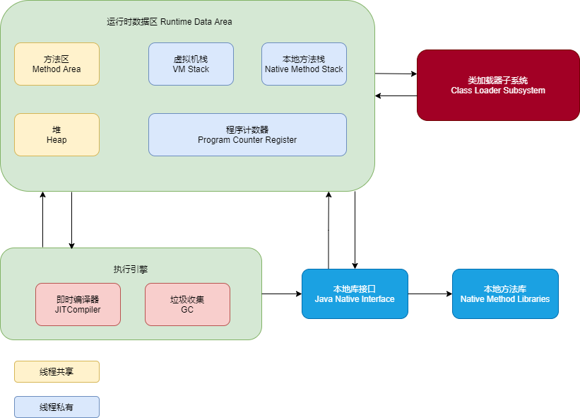

####  1 访问修饰符public、private、protected、以及不写（默认）时的区别？

| 修饰符    | 当前类 | 同 包 | 子 类 | 其他包 |
| --------- | ------ | ----- | ----- | ------ |
| public    | √      | √     | √     | √      |
| protected | √      | √     | √     | ×      |
| default   | √      | √     | ×     | ×      |
| private   | √      | ×     | ×     | ×      |

#### 2 String 是最基本的数据类型吗？

不是，是**引用类型**，Java 中的基本数据类型只有8个：byte、short、int、long、float、double、char、boolean；

#### 3 float f=3.4;是否正确？

不正确，3.4 是双精度数 ，将双精度型（double）赋值给浮点型（float）属于下转型会造成精度损失，float f =(float)3.4，float f =3.4F;

#### 4 short s1 = 1; s1 = s1 + 1;有错吗?short s1 = 1; s1 += 1;有错吗？

short s1 = 1; s1 = s1 + 1：1是int类型， s1+1 结果也是 int  型，需要强制转换类型才能赋值给short型。

short s1 = 1; s1 += 1：正确，会隐含的强制类型转换 s1 = (short)(s1 + 1)。

#### 5 int 和 Integer 有什么区别？

* int 是基本数据类型

* Integer 是 int 是**包装类**，从 Java 5 开始引入了**自动装箱/拆箱**机制，每个基本类型都对应一个包装类。

 原始类型：boolean，char，byte，short，int，long，float，double 

 包装类型：Boolean，Character，Byte，Short，Integer，Long，Float，Double

```java
Integer x = 2;     // 自动装箱  Integer.valueOf(2)
int y = x;         // 自动拆箱  X.intValue()
```

#### 6 new Integer(120) 与 Integer.valueOf(120) 有何区别？

- new Integer(123) 每次都会新建一个对象；
- Integer.valueOf(123) 会使用缓存池中的对象，多次调用会取得同一个对象的引用。

```java
//valueOf 会使用缓存池
public static Integer valueOf(int i) {
    if (i >= IntegerCache.low && i <= IntegerCache.high)
        return IntegerCache.cache[i + (-IntegerCache.low)];
    return new Integer(i);
}


static final int low = -128;
static final int high;
static final Integer cache[];

//整型字面量的值在-128到127之间，不会 new 对象,而是直接引用常量池中的Integer对象
static {
    // high value may be configured by property
    int h = 127;
    String integerCacheHighPropValue =
        sun.misc.VM.getSavedProperty("java.lang.Integer.IntegerCache.high");
    if (integerCacheHighPropValue != null) {
        try {
            int i = parseInt(integerCacheHighPropValue);
            i = Math.max(i, 127);
            // Maximum array size is Integer.MAX_VALUE
            h = Math.min(i, Integer.MAX_VALUE - (-low) -1);
        } catch( NumberFormatException nfe) {
            // If the property cannot be parsed into an int, ignore it.
        }
    }
    high = h;

    cache = new Integer[(high - low) + 1];
    int j = low;
    for(int k = 0; k < cache.length; k++)
        cache[k] = new Integer(j++);

    // range [-128, 127] must be interned (JLS7 5.1.7)
    assert IntegerCache.high >= 127;
}

//例子：
Integer f1 = 100; 
Integer f2 = 100; 
Integer f3 = 150;
Integer f4 = 150;

System.out.println(f1 == f2);//true
System.out.println(f3 == f4);//false
```

#### 7 &和&&的区别

* &
  * 按位与
  * 逻辑与（没有短路功能）
* &&
  * 逻辑与（具有短路功能）

#### 8 Math.round(11.5) 等于多少？Math.round(-11.5)等于多少？

四舍五入。

Math.round(11.5) => 12 

Math.round(-11.5) => -11

#### 9 switch 是否能作用在 byte 上，是否能作用在 long 上，是否能作用在String上？

switch 支持 int 和枚举类型，可以用 char,byte,short,int 类型，**jdk7 中支持 string 类型**，但是不支持 long 类型Java。

#### 10 一个".java"源文件中是否可以包含多个类（不是内部类）？有什么限制？

可以，但一个源文件中最多只能有一个公开类（public class）而且文件名必须和公开类的类名完全保持一致。

#### 11 用最有效率的方法计算2乘以8

 2 << 3

#### 12 数组有没有 length() 方法？String 有没有 length() 方法？

数组没有 length()，只有 length 属性。

String 有 length() 方法。

#### 13 在 Java中，如何跳出当前的多重嵌套循

使用标号。

```java
ok:
for(int i = 0;i < 10;i++){
     for(int j = 0;j < 10;j++){
     system.out.println("i="+i+",j="+j);
     if(j==5) break ok;
   }
}
```

#### 14 构造器（constructor）是否可被重写（override）

不能，但是能被重载。

#### 15 两个对象值相同 x.equals(y) == true，但却可有不同的 hashcode，对不对？

不对，如果两个对象 x和 y 满足 x.equals(y) == true，它们的哈希码（hash code）应当相同。

#### 16 是否可以继承 String 类？

String 类是 final 类，不可被继承。

#### 17 当一个对象被当作参数传递到一个方法后，此方法可改变这个对象的属性，并可返回变化后的结果，那么这里到底是值传递还是引用传递？

值传递，Java **没有引用传递**，看似引用传递，其实传递的是地址的值。

#### 18 String 和 StringBuilder、StringBuffer的区别？

* String ：只读字符串，内容是不能被改变的。
* StringBuilder：字符串对象可以直接进行修改，Java 5 引入，线程不安全。
* StringBuffer：字符串对象可以直接进行修改，方法都被 synchronized 修饰，**线程安全**。

#### 19 重载（Overload）和重写（Override）的区别，重载的方法能否根据返回类型进行区分？

* 重载（Overload）：在一个类中，方法名字相同，而参数不同。
* 重写（Override）：子类对父类的方法进行重新编写， 返回值和形参都不能改变。

返回值类型作为函数运行之后的一个状态，他是保持方法的调用者与被调用者进行通信的关键，并不能作为某个方法的标识，所以通过返回类型并不能区分重载的方法，应该根据所要区分的方法的方法名是否相同并且方法中所带的参数去区分。

#### 20 抽象类（abstract class）和接口（interface）有什么异同？

* 抽象类和接口都**不能够实例化**，但可以定义抽象类和接口类型的引用。
* 一个类如果继承了某个抽象类或者实现了某个接口都需要对其中的抽象方法全部进行实现，否则该类仍然需要被声明为抽象类。
* 接口比抽象类更加抽象，因为抽象类中可以定义构造器，可以有抽象方法和具体方法，而接口中不能定义构造器而且其中的方法全部都是抽象方法。
* 抽象类中的成员可以是 private、默认、protected、public 的，而接口中的成员全都是 public 的。
* 抽象类中可以定义成员变量，而接口中定义的成员变量实际上都是常量。
* 有抽象方法的类必须被声明为抽象类，而抽象类未必要有抽象方法。

#### 21 char 型变量中能不能存贮一个中文汉字，为什么？

**可以**，Java 中使用编码是 Unicode，一个 char 类型占2个字节，一个中文占两个字节。

#### 22 静态嵌套类(Static Nested Class)和内部类（Inner Class）的不同？

* 静态嵌套类：可以**不依赖**于外部类实例被实例化。
* 内部类：需要外部类实例化后才能被实例化。

```java
//下面的代码哪些地方会产生编译错误？
class Outer {

    class Inner {}

    public static void foo() { 
        new Inner(); //错误： new Outer().new Inner();11
    }

    public void bar() { 
        new Inner(); 
    }

    public static void main(String[] args) {
        new Inner(); //错误： new Outer().new Inner();
    }
}
```

#### 23 抽象的（abstract）方法是否可同时是静态的（static）,是否可同时是本地方法（native），是否可同时被 synchronized 修饰？

不能。

#### 24 静态变量和实例变量的区别？

静态变量：被 static 修饰符修饰的变量，也称为类变量，它属于类，可以通过 **类名.静态变量** 调用。

实例变量：实例变量依赖于某一实例，，可以通过 **实例.变量** 调用。

#### 25 一个类中静态（static）方法是否可以调用非静态（non-static）方法？

不可以，静态方法只能访问静态成员，因为非静态方法的调用要先创建对象，在调用静态方法时可能对象并没有被初始化。

#### 26 如何实现对象克隆

* 浅复制：实现Cloneable接口并重写Object类中的clone()方法；
* 深复制：实现 Serializable 接口，通过对象的序列化和反序列化实现克隆，可以实现真正的深度克隆，代码如下。

```java
public class MyUtils {

    private MyUtils() {
        throw new AssertionError();
    }

    @SuppressWarnings("unchecked")
    public static <T extends Serializable> T clone(T obj) throws Exception {
        ByteArrayOutputStream bout = new ByteArrayOutputStream();
        ObjectOutputStream oos = new ObjectOutputStream(bout);
        oos.writeObject(obj);

        ByteArrayInputStream bin = new ByteArrayInputStream(bout.toByteArray());
        ObjectInputStream ois = new ObjectInputStream(bin);
        return (T) ois.readObject();
    }
}
```

#### 27 String s = new String("xyz");创建了几个字符串对象？

两个对象，一个是静态区的 "xyz"，一个是用 new 创建在堆上的对象。

#### 28 接口是否可继承（extends）接口？抽象类是否可实现（implements）接口？抽象类是否可继承具体类（concrete class）？

可以

#### 29 断点续传

断点续传就是在上一次下载断开的位置开始继续下载。 HTTP 协议中， 可以在请求报文头中加入 Range 段， 来表示客户机希望从何处继续下载。  HTTP/1.1 开始就支持了（这也是分快传输的实现）。 一般断点下载时才用到 **Range 和 Content-Range** 实体头，断线续传的 HTTP 状态码是 206。

使用 Java 可以类似以下：

* setRequestProperty("Range","bytes=startIndex-endIndex")，告诉服务器，数据从哪里开始，到哪里结束。
* 客户端使用 RandomAccessFile 的 seek() 在任意位置写入操作。

#### 30 Java 中的final关键字有哪些用法？

* 修饰类：该类不能被继承；
* 修饰方法：方法不能被重写；
* 修饰变量：变量只能一次赋值以后值不能被修改（常量）；

#### 31 try{}里有一个return语句，那么紧跟在这个try后的finally{}里的代码会不会被执行，什么时候被执行，在return前还是后?

会执行，在方法返回调用者前执行。

#### 32 阐述final、finally、finalize的区别？

final：

* 修饰类：该类不能被继承；
* 修饰方法：方法不能被重写；
* 修饰变量：变量只能一次赋值以后值不能被修改（常量）；

finally：

* 放在try…catch…的后面构造总是执行代码块

finalize：

* Object 类中的方法，重写 finalize() 方法可以进行一些释放资源操作。

#### 33 Collection和Collections的区别？

* Collection 是一个接口，它是Set、List等容器的父接口；

* Collections 是个一个工具类，提供一系列的静态方法来辅助容器操作；

#### 34 Thread 类的 sleep() 方法和对象的 wait() 方法都可以让线程暂停执行，它们有什么区别?

* sleep()：会持有锁；
* wait()：会释放锁，需要调用对象的 notify() 或 notifyAll() 方法；

#### 35 线程的 sleep() 方法和 yield() 方法有什么区别？

* sleep()：线程转入阻塞（blocked）状态。
* yield()：线程转入就绪（ready）状态，暂停当前正在执行的线程对象，并执行其他线程，但是无法保证达到让出目的，可能被立马有被调度。

#### 36 实现多线程程序有几种实现方式？

* Runnable
* Thread
* Callable

#### 37 Java 语言有什么特点？

* 简单性
* 面向对象
* 分布性
* 编译和解释性
* 稳健性
* 安全性
* 可移植性
* 高性能
* 支持多线程
* 动态性

#### 38 JVM、JDK、JRE 区别？

* JDK ：是 Java 开发工具包，是 Sun公司针对 Java 程序员的产品，JDK 中**包含 JRE**；

* JRE： 是运行基于 Java 语言编写的程序所不可缺少的**运行环境**，JRE 中包含了 JVM。

* JVM：Java 虚拟机，是实现  Java 跨平台，“一次编译，随处运行”的核心，运行 Java **字节码**，Java 程序会被编译成 .class 文件

> Java 程序运行经过三个步骤：
>
> Java 文件（源代码）-----JDK 中 javac 的编译-----> .class 文件（JVM 可理解的 Java 文件） -----JVM-----> 机器可执行的二进制机器码

#### 39 Oracle JDK 和 OpenJDK 的对比？

* Oracle JDK 版本将每三年发布一次，而 OpenJDK 版本每三个月发布一次；
* OpenJDK 是一个参考模型并且是**完全开源**的，而 Oracle JDK 是 OpenJDK 的一个实现，并不是完全开源的；

* Oracle JDK 比 OpenJDK 更稳定。OpenJDK 和 Oracle JDK 的代码几乎相同，但 Oracle JDK有更多的类和一些错误修复。因此，如果您想开发企业/商业软件，我建议您选择 Oracle JDK，因为它经过了彻底的测试和稳定。某些情况下，有些人提到在使用 OpenJDK 可能会遇到了许多应用程序崩溃的问题，但是，只需切换到 Oracle JDK 就可以解决问题；

* 在响应性和 JVM 性能方面，Oracle JDK 与 OpenJDK 相比提供了更好的性能；

* Oracle JDK 不会为即将发布的版本提供长期支持，用户每次都必须通过更新到最新版本获得支持来获取最新版本；

* Oracle JDK 根据二进制代码许可协议获得许可，而 OpenJDK 根据 GPL v2 许可获得许可。


#### 40 Java 和 C++ 的区别?

1. Java 源码先编译，成为中间码，中间码再被解释器解释成机器码。对于Java而言，中间码就是字节码(.class)，而解释器在JVM中内置了。
2. C++ 源码一次编译，直接在编译的过程中链接了，形成了**机器码**。
3. C++ 比 Java执行速度快，但是 Java 可以利用 JVM 跨平台。
4. Java 是纯面向对象的语言，所有代码（包括函数、变量）都必须在类中定义。而 C++ 中还有面向过程的东西，比如是全局变量和全局函数。
5. C++ 中有指针，Java 中没有，但是有引用。
6. C++ 支持多继承，Java 中类都是单继承的。但是继承都有传递性，同时 Java 中的接口是多继承，类对接口的实现也是多实现。
7. C++中，开发需要自己去管理内存， Java 中 JVM 有自己的GC机制，虽然有自己的 GC 机制，但是也会出现OOM 和内存泄漏的问题。C++ 中有析构函数，Java 中 Object 的 finalize 方法。
8. C++ 运算符可以重载， Java 中不可以。同时 C++ 中支持强制自动转型，Java 中不行，会出现ClassCastException（类型不匹配）。

#### 41 import java 和 javax 有什么区别？

刚开始的时候  Java API 所必需的包是 java 开头的包，javax 当时只是扩展 API 包来使用。然而随着时间的推移，javax 逐渐地扩展成为 Java API 的组成部分。但是，将扩展从 javax 包移动到 java 包确实太麻烦了，最终会破坏一堆现有的代码。因此，最终决定 javax 包将成为标准API的一部分。所以，实际上 java 和 javax **没有区别**，这都是一个名字。

#### 42 Java 语言是编译与解释并存？

编译：所有的 Java 代码都是要编译的，.java 不经过编译没啥卵用。

解释：java 代码编译后生成字节码（ .class 文件 ）不能直接运行，它是解释运行在 JVM 上的，所以它是解释运行的。

#### 43 字符型常量和字符串常量的区别？

* 形式上: 字符常量是单引号（‘ ’）引起的一个字符; 字符串常量是双引号（" "）引起的 0 个或若干个字符.

* 含义上: 字符常量相当于一个整型值( ASCII 值),可以参加表达式运算; 字符串常量代表一个地址值(该字符串在内存中存放位置).

* 占内存大小：字符常量只占 2 个字节; 字符串常量占若干个字节 (**注意： char 在 Java 中占两个字节**)。

#### 44 Java 基本类型占用内存大小？

- byte/8 bit
- char/16 bit
- short/16 bit
- int/32 bit
- float/32 bit
- long/64 bit
- double/64 bit
- boolean/~

#### 45 Java 注释

```java
// 单行注释
/* 多行注释 */
```

#### 46 自增自减运算符

++i，先加 1 后赋值。

i++，先赋值后加 1。

符号在先，先加/减，符号在后，后加/减。

#### 47 Java 标识符和关键字

**标识符**：是为方法、变量或其他用户定义项所定义的名称。标识符可以有一个或多个字符。在 Java 语言中，标识符的构成规则如下：

- 标识符由数字（0~9）和字母（A~Z 和 a~z）、美元符号（$）、下划线（_）以及 Unicode 字符集中符号大于 0xC0 的所有符号组合构成（各符号之间没有空格）。
- 标识符的第一个符号为字母、下划线和美元符号，后面可以是任何字母、数字、美元符号或下划线。

**关键字**（或者保留字）：是对编译器有特殊意义的固定单词，不能在程序中做其他目的使用。关键字具有专门的意义和用途，和自定义的标识符不同，不能当作一般的标识符来使用。

Java 语言目前定义了 51 个关键字，这些关键字不能作为变量名、类名和方法名来使用。

1. 数据类型：boolean、int、long、short、byte、float、double、char、class、interface。
2. 流程控制：if、else、do、while、for、switch、case、default、break、continue、return、try、catch、finally。
3. 修饰符：public、protected、private、final、void、static、strict、abstract、transient、synchronized、volatile、native。
4. 动作：package、import、throw、throws、extends、implements、this、supper、instanceof、new。
5. 保留字：true、false、null、goto、const。

#### 48 continue、break、和 return 的区别？

* continue ：跳出当前循环，继续下一次循环。
* break ：跳出整个循体，继续执行循环下面的语句。
* return:
  * return：直接使用 return 结束方法执行，用于没有返回值函数的方法
  * return value ：return 一个特定值，用于有返回值函数的方法

#### 49 == 和 equals 区别？

* **==**：判断两个对象的**地址**是否相等（基本数据类型比较的是值，引用数据类型比较的是内存地址）
* **equals()**：判断两个对象内容是否相等，是 Object 里面的方法。

```java
public boolean equals(Object obj) {
      return (this == obj);
}
//类没有覆盖 equals()方法，通过 equals() 比较该类的两个对象时，等价于“==”。
//类覆盖 equals() 方法，来判断两个对象的内容相等。
```

#### 50 hashCode()与 equals()

hashCode()：作用是**获取哈希码**，也称为散列码，实际上是返回一个 int 整数。这个**哈希码的作用**是确定该对象在哈希表中的索引位置。

```java
散列表的本质是通过数组实现的。当我们要获取散列表中的某个“值”时，实际上是要获取数组中的某个位置的元素。而数组的位置，就是通过“键”来获取的；更进一步说，数组的位置，是通过“键”对应的散列码计算得到的。
```

重写  equals 时必须重写 hashCode 方法：

如果两个对象相等，则 hashcode 一定相同的。两个对象相等,对两个对象分别调用 equals 方法都返回 true。但是，两个对象有相同的 hashcode 值，它们也不一定是相等的 。因此，equals 方法被覆盖过，则 hashCode() 也必须被覆盖。

#### 51 Java 只有值传递

* 值传递：在调用函数时，将实际参数值复制一份传递到被调用函数中，在被调函数中修改参数值不会影响原实参值。
* 引用传递：在调用函数时，将实际参数的地址直接传递到被调用的函数中，在被调函数中修改参数值会影响原实参值。

Java 程序设计语言总是采用**按值调用**，方法得到的是所有参数值的一个拷贝，也就是说，方法不能修改传递给它的任何参数变量的内容。

#### 52 在 Java 中定义一个不做事且没有参数的构造方法的作用？

Java 程序在执行子类的构造方法之前，如果没有用 `super()`来调用父类特定的构造方法，则会调用父类中“没有参数的构造方法”。因此，如果父类中只定义了有参数的构造方法，而在子类的构造方法中又没有用 `super()`来调用父类中特定的构造方法，则编译时将发生错误，因为 Java 程序在父类中找不到没有参数的构造方法可供执行。解决办法是在父类里加上一个不做事且没有参数的构造方法。

#### 53 对象的相等与指向他们的引用相等,两者有什么不同?

* 对象的相等：比内存中存放的内容是否相等
* 引用相等：内存地址是否相等

#### 54 面向对象三大特征

* 封装：隐藏对象的属性和实现细节，仅对外公开接口，控制在程序中属性的读和修改的访问级别，将抽象得到的数据和行为（或功能）相结合，**形成一个有机的整体**，也就是将数据与操作数据的源代码进行有机的结合，形成“类”，其中数据和函数都是类的成员。
* 继承：允许创建分等级层次的类。**继承就是子类继承父类的特征和行为**，使得子类对象（实例）具有父类的实例域和方法，或子类从父类继承方法，使得子类具有父类相同的行为。
* 多态：同一个行为具有多个不同表现形式或形态的能力。是指一个类实例（对象）的相同方法在不同情形有不同表现形式。多态机制使具有不同内部结构的对象可以共享相同的外部接口。这意味着，虽然针对不同对象的具体操作不同，但通过一个公共的类，它们（那些操作）可以通过相同的方式予以调用。

#### 55 在一个静态方法内调用一个非静态成员为什么是非法的？

由于静态方法可以不通过对象进行调用，因此在静态方法里，不能调用其他非静态变量，也不可以访问非静态变量成员。

#### 56 Object 类常见的方法？

```java
//native方法，用于返回当前运行时对象的Class对象，使用了final关键字修饰，故不允许子类重写。
public final native Class<?> getClass()
    
//native方法，用于返回对象的哈希码，主要使用在哈希表中，比如JDK中的HashMap。
public native int hashCode() 
    
//用于比较2个对象的内存地址是否相等，String类对该方法进行了重写用户比较字符串的值是否相等。    
public boolean equals(Object obj)

//naitive方法，用于创建并返回当前对象的一份拷贝。一般情况下，对于任何对象 x，表达式 x.clone() != x 为true，x.clone().getClass() == x.getClass() 为true。Object本身没有实现Cloneable接口，所以不重写clone方法并且进行调用的话会发生CloneNotSupportedException异常。
protected native Object clone() throws CloneNotSupportedException

//返回类的名字@实例的哈希码的16进制的字符串。建议Object所有的子类都重写这个方法。    
public String toString()

//native方法，并且不能重写。唤醒一个在此对象监视器上等待的线程(监视器相当于就是锁的概念)。如果有多个线程在等待只会任意唤醒一个。    
public final native void notify()

//native方法，并且不能重写。跟notify一样，唯一的区别就是会唤醒在此对象监视器上等待的所有线程，而不是一个线程。    
public final native void notifyAll()

//native方法，并且不能重写。暂停线程的执行。注意：sleep方法没有释放锁，而wait方法释放了锁 。timeout是等待时间。    
public final native void wait(long timeout) throws InterruptedException

//多了nanos参数，这个参数表示额外时间（以毫微秒为单位，范围是 0-999999）。 所以超时的时间还需要加上nanos毫秒。    
public final void wait(long timeout, int nanos) throws InterruptedException

//跟之前的2个wait方法一样，只不过该方法一直等待，没有超时时间这个概念    
public final void wait() throws InterruptedException

//实例被垃圾回收器回收的时候触发的操作    
protected void finalize() throws Throwable { }
```

#### 57 Java 序列化中如果有些字段不想进行序列化，如何做？

使用 transient 。

```java
public class Person {
    private String name;
    private Integer age;
    private transient Integer weigth;
    ...
}
```

#### 59  BIO、NIO、AIO 区别？

##### BIO 同步阻塞IO

基于**流模型**实现的，交互的方式是同步、阻塞方式，也就是说在读入输入流或者输出流时，在读写动作完成之前，线程会一直阻塞在那里，它们之间的调用时可靠的线性顺序。

优点：代码比较简单、直观

缺点：IO 的效率和扩展性很低，容易成为应用性能瓶颈

#####  NIO 同步非阻塞IO

 Java 1.4 引入的 java.nio 包，提供了 Channel、Selector、Buffer 等新的抽象，可以构建**多路复用**的、同步非阻塞 IO 程序，同时提供了更接近操作系统底层高性能的数据操作方式。

##### AIO 异步非阻塞IO

是 Java 1.7 之后引入的包，是 NIO 的升级版本，提供了异步非堵塞的 IO 操作方式，所以称为AIO（Asynchronous IO），异步 IO 是基于事件和回调机制实现的，也就是应用操作之后会直接返回，不会堵塞在那里，当后台处理完成，操作系统会通知相应的线程进行后续的操作。

#### 60 重载和重写的区别？

重载：发生在同一个类中，方法名必须相同，参数类型不同、个数不同、顺序不同，方法返回值和访问修饰符可以不同，发生在编译时。

重写：发生在父子类中，方法名、参数列表必须相同，返回值范围、抛出异常小于等于父类，访问修饰符大于等于父类。如果父类方法访问修饰符为 private，则子类就不能重写该方法，两同一小。

#### 61 成员变量与局部变量区别？

* 语法：成员变量是属于类的，局部变量是在代码块或方法中定义的变量或是方法的参数；成员变量可以被 public,private,static 等修饰符所修饰，局部变量不能被访问控制修饰符及 static 所修饰；成员变量和局部变量都能被 final 所修饰。

* 变量在内存中的存储方式：如果成员变量是使用`static`修饰的，这个成员变量是属于类，如果没有使用`static`修饰，这个成员变量是属于实例；而对象存在于堆内存，局部变量则存在于栈内存。

* 变量在内存中的生存时间：成员变量是对象的一部分，它随着对象的创建而存在，而局部变量随着方法的调用而存在。

* 默认值：成员变量以类型的默认值赋值（被 final 修饰的成员变量须显式地赋值）；局部变量则不会自动赋值。

#### 62 类的构造方法的作用是什么? 若一个类没有声明构造方法，该程序能正确执行吗? 为什么?

作用：类对象初始化工作。

可以，一个类如果没有声明构造方法也会有默认的不带参数的构造方法。

#### 64 运行时数据区



#### 65 JVM 内存区域

