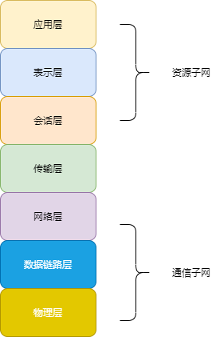

## 1 计算机网络的概念

计算机网络：是一个将分散的、具有独立功能的计算机系统，通过通信设备与线路连接起来，由功能完善的软件实现**资源共享**和**信息传递**的系统。

简单来说：计算机网络是互连的、自治计算机系统的集合。

## 2 计算机网络的功能

* **数据通信**
* **资源共享**
* 分布式处理
* 提高可靠性
* 负载均衡

## 3 计算机网络的组成

### 3.1 按组成部分

* 硬件：主机（端系统）、通信链路（光纤、双绞线）、交换设备（路由器、交换机）、通信处理机（网卡等）。
* 软件：实现资源共享的软件以及方便用户使用的工具软件（聊天工具、FTP程序、网络操作系统、邮件收发程序）。
* 协议：计算机网络的核心，规定网络传输数据遵守的规定。

### 3.2 按工作方式

* 边缘部分：用户直接使用（C/S方式、P2P方式）。
* 核心部分：为边缘部分服务。

### 3.3 按功能组成

* 通信子网：各种传输介质、通信设备、相应的协议组成。
* 资源子网：实现资源共享的设备和软件集合。

 

## 4 计算机网络的分类

### 4.1 按分布范围分类

* 广域网WAN：采用交换技术
* 城域网MAN
* 局域网LAN：采用广播技术
* 个人局域网PAN

### 4.2 按使用者分类

* 公用网：中国电信、中国移动等
* 专用网：军队、电力、铁路

### 4.3 按交换技术分类

* 电路交换
* 报文交换
* 分组交换

### 4.4 按拓扑结构分类

* 总线型
* 星型
* 环型
* 网状型

### 4.5 按传输技术分类

* 广播式网络：一台计算机发送报文，其他计算机都能听到（采用广播技术）
* 点对点网络：计算机通过直接或中间结点对分组进行接收、存储和转发直到目的地（采用存储转发机制）

## 5 计算机网络标准化工作及相关组织

### 5.1 生成 RFC 过程

* 因特网草案
* 建议标准
* 草案标准
* 因特网标准

### 5.2 国际组织

* 国际标准化组织（ISO）：OSI 参考模型、HDLC 协议
* 国际电信联盟（ITU）：远程通信标准
* 国际电气电子工程师协会（IEEE）：802标准、学术机构

## 6 计算机网络的性能指标

### 6.1 速率

连接在计算机网络上的主机数字信道上传送数据位数的速率，单位：b/s(比特/每秒)、Mb/s、Gb/s、Tb/s。

### 6.2 带宽

网络在通信线路中传送数据的能力，单位：b/s(比特/每秒)、kb/s、Mb/s、Gb/s、Tb/s。

### 6.3 吞吐量

单位时间内通过某个网络的数据量，受网络带宽或网络额定速率的限制。

### 6.4 时延

### 6.5 时延带宽积

### 6.6 往返时延RTT

### 6.7 利用率