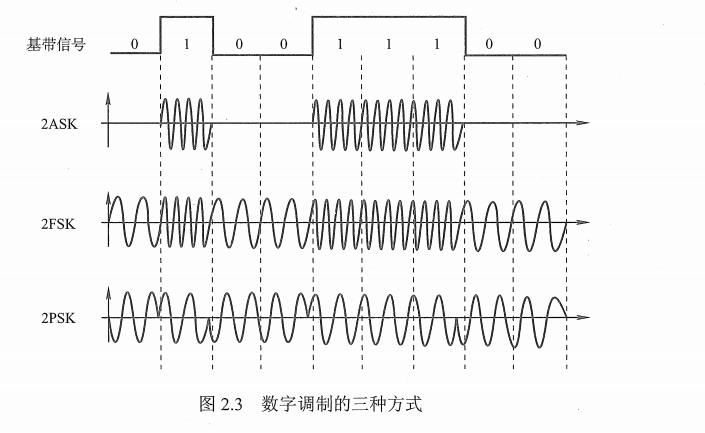
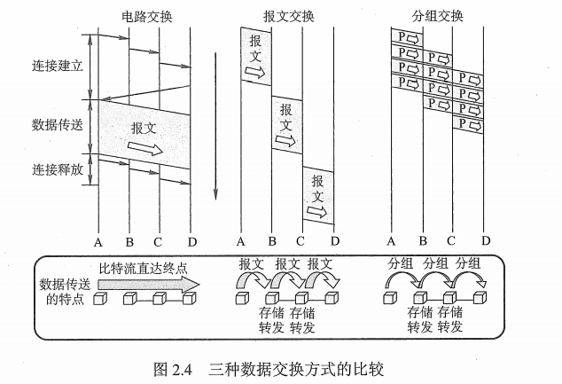

## 1 基本概念

* 数据：传送信息的实体，指数据的电气或电磁表现，是数据在传输过程中的存在形式
  - 模拟数据（模拟信号）：连续变化的数据或信号
  - 数字数据（数字信号）：取值仅允许为有限的几个离散数值的数据称为数字信号或数字数据
* 传输方式
  * 串行传输：一个一个比特按照时间顺序传输
  * 并行传输：多个比特通过多条通信信道传输
* 码元：一个固定时长的信号波形（数字脉冲）表示一个K进制数字，代表不同离散数据的基本波形。这个时长内信号称为K进制码元，该时长称为码元宽度
* 信源：产生和发送数据的源头
* 信道
  - 发送端信源发送的信息经过变换成合成的信号在信道上传输到信宿
  - 信道是信号的传输媒介
  - 噪声源是指信道上的噪声（对信号的干扰），及分散在通信系统其它各处的噪声的集中表示
* 信宿：接收数据的终点
* 带宽：网络的通信线路所能传输数据的能力（b/s）
* 速率：
  - 数据的传输速率，单位时间内传输的数据量
  - 码元传输速率（码元速率，波形速率）：单位时间内数字通信系统所传输的码元个数（单位是波特）
  - 信息传输速率（信息速率，比特率）：表示单位时间内数字通信系统传输的二进制码元个数（比特数）单位是比特/秒

信道分类：

* 信号传输形式的不同

  - 传送模拟信号的模拟信道

  - 传送数字信号的数字信道

* 传输介质的不同
  - 无线信道
  - 有线信道

### 1.1 通信交互方式

* 单工通信：只有一个方向的通信，没有反方向的交互（无线电广播、电视广播）-> 广播
* 半双工通信：通信双方都可以发送和接收信息，但是不能同时进行（需要两条信道） -> 对讲机
* 全双工通信：通信双方可以同时发送和接收信息，需要两条信道 -> 打电话

## 2 奈奎斯特定理与香农定理

奈奎斯特定理：

* 理想低通 （没有噪声、带宽有限）信道下的极限数据传输速率 = 2Wlog2V（单位b/s）(W是理想低通信道带宽，单位HZ)

香农定理：

* 带宽受限且有噪声干扰的信道的极限数据传输率 = Wlog2（1+S/N)（单位b/s）(W信道的带宽、S为信道所传输信号的平均功率、N为信道内部高斯噪声功率)

## 3 编码与调制

### 3.1 调制

数据 -> 模拟信号

### 3.2 编码

数据 -> 数字信号

### 3.3 数字数据编码为数字信号

数字数据编码用于**基带传输**中，在不改变数字信号频率的情况下，直接传输数字信号

* 非归零编码：两个电压表示二进制数字，低电平为 0 ，高电平为 1
* 曼彻斯特编码：将一个码元分为两个相等的间隔，前高后低为 1，前低后高为 0，以太网使用
* 差分曼彻斯特编码：若码元为1 前半个码元的电平与上一个码元的电平相同，为 0 相反，局域网使用

### 3.4 数字数据调制为模拟信号

* 幅移键控（ASK)
* 频移键控（FSK）
* 相移键控（PSK）
* 正交振幅调制（QAM）

### 3.5 模拟数据编码为数字信号

* 采样：周期性扫描
* 量化：把连续的电平值转换成离散的数字量
* 编码：转化为二进制编码

### 3.6 模拟数据调制为模拟信号

使用频分复用（FDM）技术，充分利用带宽资源

## 4 数据交换方式

| 方式     | 简介                                                         | 优点                                                         | 缺点                                                         |
| -------- | ------------------------------------------------------------ | ------------------------------------------------------------ | ------------------------------------------------------------ |
| 电路交换 | 数据传输前，先建立一条专用的物理通信路径，直通方式传输数据，需经过连接建立、数据传输、连接释放三个阶段 | 通信时延小、有序传输、没有冲突、适用性范围广、实时性强、控制简单 | 建立时间长、线路独占、不灵活、无数据存储能力、难以规则化     |
| 报文交换 | 数据交换的单位是报文，报文携带目的地址、源地址等信息，采用存储转发方式 | 无需建立连接、动态分配线路、提高线路可靠性、提高线路利用率、提供多目标服务 | 数据进入交换节点后要经过存储、转发，存在时延，如果是大数据，需较大缓存空间 |
| 分组交换 | 采用存储转发方式，把大数据分割成小数据，并携带一些信息；分为数据报方式和虚电路方式 | 没有建立时延、线路利用率高、减缓了存储管理、加速传输、减少了出错率和重发数据量 | 存在传输时延、需要额外的信息量、可能出现数据包错误           |

分组交换分类：

* 数据报方式：**面向无连接**的数据传输，工作过程类似于报文交换，采用数据报方式传输时，被传输的分组称为数据报。
* 虚电路方式：**面向连接**的数据传输，工作过程类似于电路交换，不同之处在于此时的电路是虚拟的。（虚电路建立、数据传输、虚电路释放）

数据报方式和虚电路方式对比

|                    | 数据报                                  | 虚电路                                            |
| ------------------ | --------------------------------------- | ------------------------------------------------- |
| 连接               | 不建立连接                              | 建立连接                                          |
| 目的地址           | 分组有完整目的地址                      | 连接建立阶段有目的地址 , 数据传输阶段使用虚电路号 |
| 路由选择           | 每个分组独立运行 , 路由选择转发         | 所有分组按照相同的路径传输                        |
| 分组顺序           | 不保证顺序                              | 保证顺序                                          |
| 可靠性             | 由主机保证                              | 由网络保证                                        |
| 网络故障适应能力   | 在网络节点故障后 , 正常传输             | 网络节点故障后 , 不能工作                         |
| 差错处理和流量控制 | 由主机进行流量控制 , 不保证数据报可靠性 | 由分组交换网 / 主机负责                           |

## 5 传输介质

### 5.1 导向传输介质

### 5.1.1 双绞线

### 5.1.2 同轴电缆

### 5.1.3 光纤

## 5.2 非导向传输介质

无线电波、微波、红外线、激光

## 6 物理层接口特性

* 机械特性
* 电气特性
* 功能特性
* 规程特性