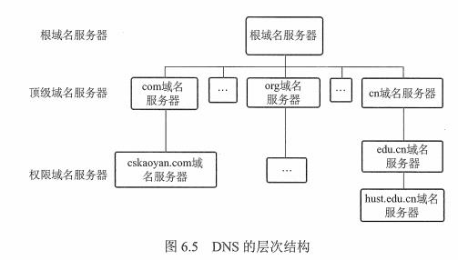
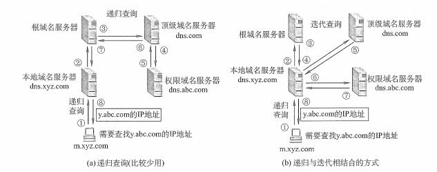

## 1 域名系统（DNS）
DNS 系统采用客户/服务器模型，其协议运行 UDP 之上，使用 53 号端口。

DNS 分为 3 部分：层次域名空间、域名服务器、解析器。

## 2 层次域名空间
www.baidu.com -> 三级域名.二级域名.顶级域名

顶级域名(国家顶级域名（cn、us、jp）、通用顶级域名（com、org、net）、基础结构域名（arpa-> 只有一个，叫方向域名解析（方向域名））)

## 3 域名服务器
域名系统被设计成联机分布式的数据库系统，并采用客户/服务器模型。4 种类型的域名服务器。
* 根域名服务器：管辖顶级域
* 顶级域名服务器：管理二级域名
* 授权域名服务器（权限域名服务器）：管辖的主机名转换为该主机的 IP 地址
* 本地域名服务器：对域名系统非常重要，ISP、一所大学、甚至一个系都可以有一个本地域名服务器。

## 4 域名解析过程
正向解析：域名 -> IP
反向解析：IP -> 域名

当客户端需要域名解析时，通过本机的DNS客户端构造一个DNS请求报文，以 UDP 数据报文 发往本地域名服务器。

域名解析有两种方式:
* 递归查询（负载过大，不常用）
* 递归与迭代相结合查询

为了提高 DNS 的查询效率，通常采用**高速缓存**，DNS 会将 DNS 信息缓存到高速缓存中，并且美国一段时间就会丢弃高速缓存。